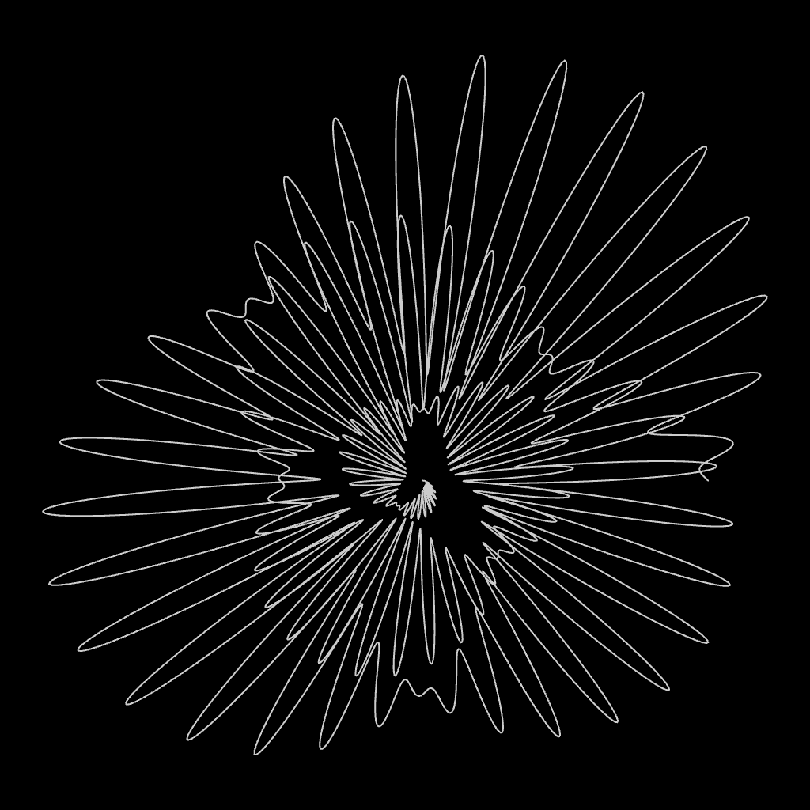
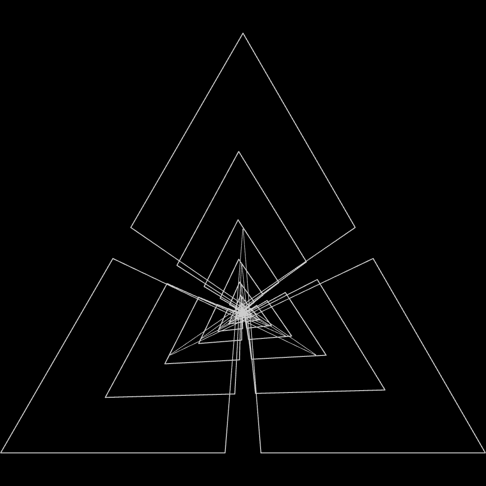
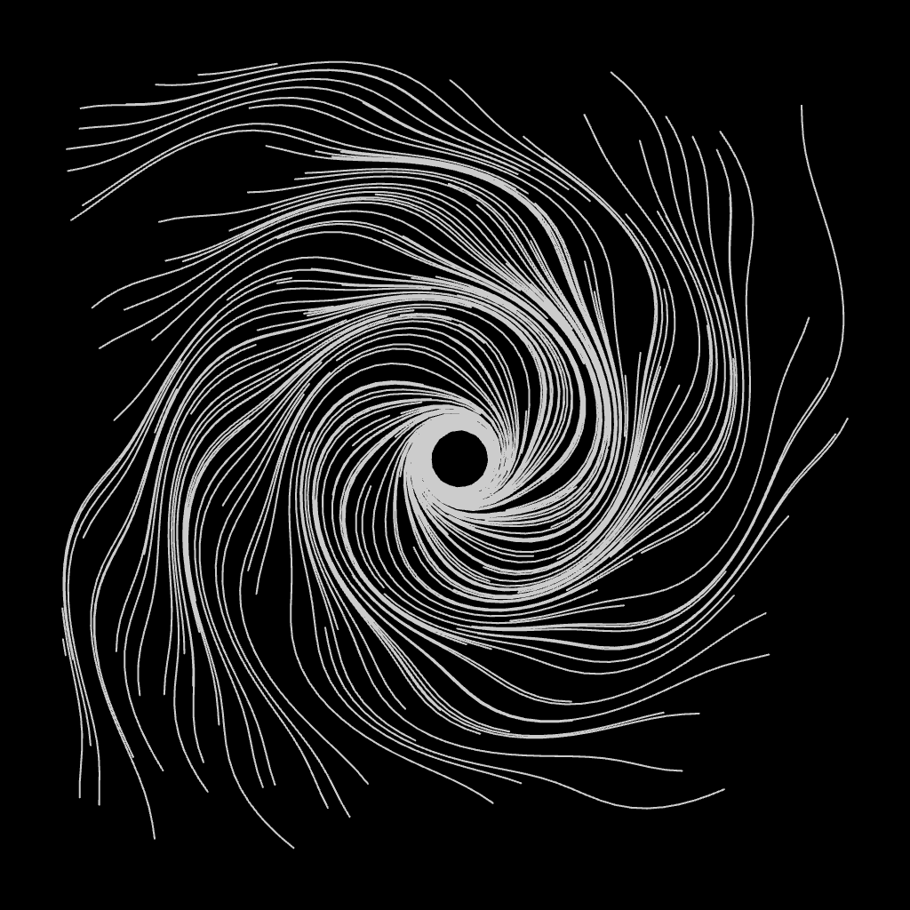
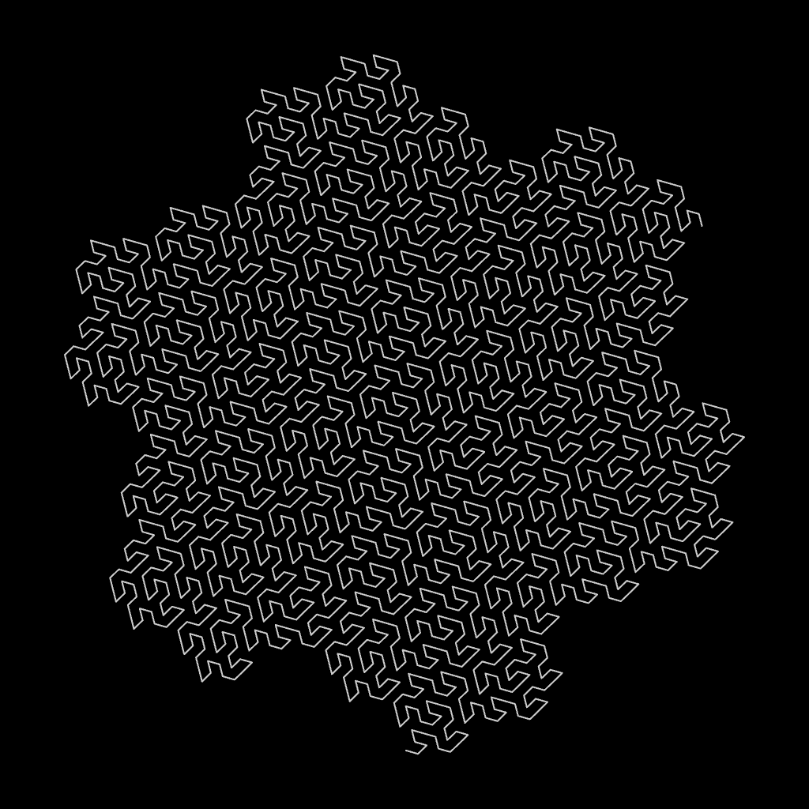
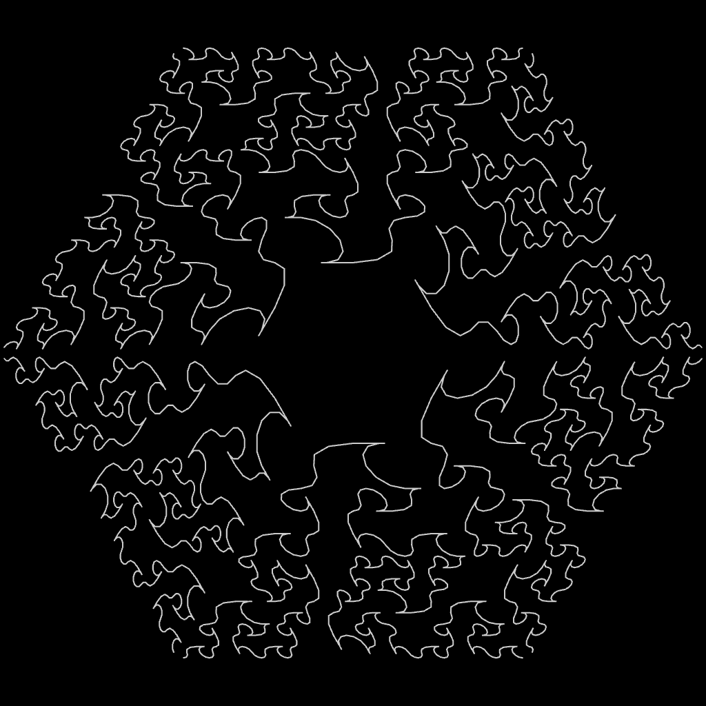
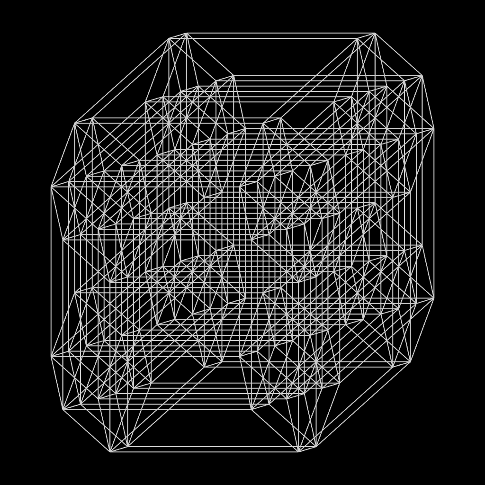
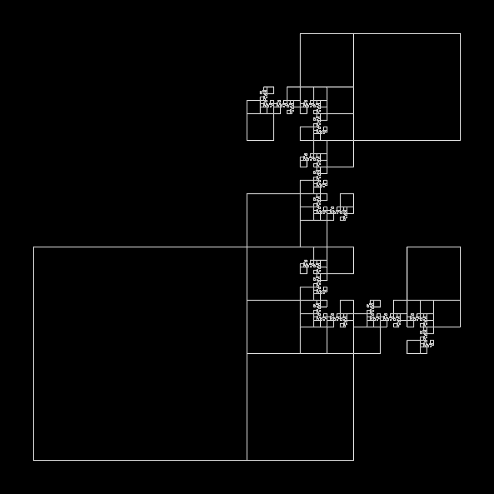
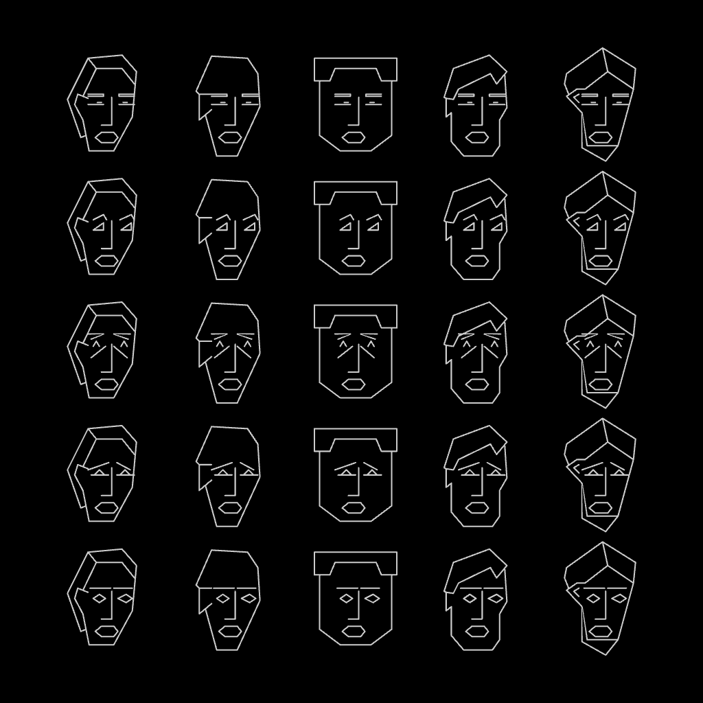

# Nouveaux dessins géométriques et artistiques — TouchDesigner POPs / laser port

This fork adds a **TouchDesigner** port of all **300 drawings** from Jean-Paul Delahaye's 1985 book. It builds on [v3ga's p5.js recoding](https://github.com/v3ga/nouveaux_dessins_geometriques_et_artistiques).

- **GPU only.** Every point of every drawing is computed on the GPU in compute shaders (POPs, the TD 2024+ operator family). There is no JavaScript, and Python never touches the geometry.
- **Laser-ready.** The output is separate polylines, so it can feed a laser projector directly.
- **Live.** Drawings can be switched and their parameters changed in real time.

The [original README](#original-project-v3ga) follows below, unchanged.

<p>
   
   
</p>

*DESSIN 42, 60, 92, 146 / 188, 222, 283, 29, rendered by the TouchDesigner preview. For comparison, the book's plotter output of [146](img/NOUVEAU_DESSIN_GEOMETRIQUE_146.png) and [188](img/NOUVEAU_DESSIN_GEOMETRIQUE_188.png).*

## Contents
- [Requirements](#requirements)
- [Quick start](#quick-start)
- [Parameters](#parameters)
- [How it works](#how-it-works)
- [Laser output](#laser-output)
- [Differences from the book](#differences-from-the-book)
- [Files](#files)
- [Credits and license](#credits-and-license)

## Requirements
- **TouchDesigner 2025.x** with POPs. The project was built and tested on **2025.33230** (macOS). Opening it in an older build may break it.
- **GPU.** Any GPU that runs TouchDesigner POPs. On macOS (Metal) all scans run in `float`, because `double` attributes are not supported there.
- **Laser, optional.** Two ways out:
  - any DAC supported by the *Laser CHOP* / *Laser Device CHOP* (Helios, Ether Dream, ShowNET);
  - **Pangolin Beyond** through the *Pangolin CHOP*, which works on **Windows only**.

## Quick start
1. Open `nouveaux_dessins_geometriques_et_artistiques.toe`.
2. Go into `/project1/ndga`.
3. On the **Global** page, turn **Dessin** (1–300). It uses the same numbers as the book and the p5.js sketches. The right engine is selected automatically.
4. Watch `ndga/preview`, an orthographic render of exactly what goes to the laser.

## Parameters
Everything is on the custom pages of `/project1/ndga`:

| Page | What |
|---|---|
| **Global** | **Dessin** (1–300), Engine (read-only), Scale, Autofit (GPU fit to frame), Rotate, Offset, laser Color, animation Speed, Points (readout) |
| **Random** | **Seed**, plus *Drift seeds over time* and Drift Speed (seeds morph smoothly, no popping) |
| **Laser** | Send to Beyond (**off by default**), Beyond Zone, Rate, Vector frame, Point Budget and Over Budget readout |
| Polar, Morph, Circles, Koch, Motif, Lines, Field, Implicit, IFS, Glyph, Turtle | live parameters for each engine: resolution / density, depth offsets, phase / warp / twist, animation toggles |

## How it works

### One contract for every engine
The book's programs drive a pen plotter:
- `M x,y` lifts the pen and moves it;
- `D x,y` draws a line to the point.

A drawing is therefore a sequence of polylines, which is exactly what a laser needs. Every engine follows the same chain:

```
meta (per-DESSIN constants from the book)
  → pts          gridPOP, N points (N = upper bound)
  → gen          glsladvancedPOP: writes P, LineBreak (= plotter "M"), [Alive]
  → [cull]       deletePOP Alive == 0     (paths of variable length, pruned trees, unused glyph rows)
  → strips       linebreakPOP             (one line strip per pen-down run)
  → out
```

The engine outputs are then combined:

```
switch_engine → autofit → fit (scale / rotate / offset) → laser_color → out_laser
```

The output space is `x, y ∈ [-1, 1]`, y-up; the book's 480-pixel plotter space is normalised to it. Everything is computed in `float`, without the `int()` rounding of the plotter strings. This removes duplicate and zero-length points.

### Engines

| Engine | DESSIN | GPU mapping |
|---|---|---|
| `engine_motif` | 1–20 | thread = (copy, vertex). The copy index is decoded in mixed radix into the K transforms (mirrors, rotations, lattice). |
| `engine_glyph` | 21–29, 287–300 | Faces and crowd glyphs come from a table fed to the shader through `dattoPOP`. Thread = (instance, table row); rows that are not the instance's glyph are culled. |
| `engine_polar` | 30–59 | thread = point. The formulas are a `switch` on DESSIN. |
| `engine_koch` | 60–69 | Each vertex is computed **directly from the base-4 digits of its index** (sum of sub-generator chords × Gᵈ). No scan is needed, and the generator angle is a live parameter. |
| `engine_lines` | 70–73, 213–246 | Independent segments: Cantor chords, moirés, projections of K-dimensional hypercubes (with a live rotation of the projection basis). |
| `engine_turtle` | 74–76, 143–212 | See below. |
| `engine_field` | 77–122 | Needles and streamlines. Thread = (seed, step j) integrates j Euler steps; leaving the unit square culls the rest. |
| `engine_morph` | 123–142 | thread = (layer, point). In-betweens of two Lissajous curves, or of a Lissajous curve and a square. |
| `engine_implicit` | 247–250 | Random walks inside F(x,y) < 0. The walk is serial, so **one thread walks one seed** and writes all of its slots. |
| `engine_circles` | 251–266 | thread = (cell, segment). The radius is proportional to the field F(x,y). |
| `engine_ifs` | 267–286 | thread = (level, copy, vertex). The base-K digits of the copy index pick the chain of maps; every level is drawn, as in the book. |

### The turtle (generalised Koch) engine
This is the largest family: 73 drawings in total — 143–182 general fractals, 183–212 their rounded variants, and 74–76. In the book a turtle walks step by step, but the heading and length of each step depend **only on the digits of the step index**. Flags B, E, C and D mirror, reverse, stop and lift the pen. This makes the walk parallel:

- **Steps.** `gen` computes every step vector independently.
- **Positions.** `scan` (`accumulatePOP`) turns the steps into positions with a prefix sum.
- **Placement.** `place` resets the sum for each curve and applies the per-drawing framing fixes of the p5 port.
- **Rounding.** `round` (183–212) replaces every corner with the book's quarter-ellipse, S+1 points per step.
- **Pruned trees.** Flag **C** prunes whole subtrees; for example, 177 walks 5¹⁰ ≈ 9.7M indices to draw about 4k steps. Threads are numbered by **live leaf** instead. Each thread turns its leaf ordinal into a digit path using subtree leaf counts `leaves(d) = n_terminal + n_recursive · leaves(d−1)`, so no thread is wasted.
- **74–76.** The heading is `AA · Σ(min(v(j), K−1) + 1)`, where v is the (N−1)-adic valuation. It is computed in closed form with Legendre's formula `Σ floor(i / bᵗ)`.

### Shader sources
The compute shaders live inside the `.toe`, in the `shader` DAT of each engine. A plain-text copy is exported to [`touchdesigner/shaders/`](touchdesigner/shaders) for reading and diffing on GitHub; the `.toe` is the source of truth. Each shader starts with a header comment that explains its mapping. `ndga/agents_md` inside the project documents the network, the traps and the deviations.

## Laser output
- **`laser_preview`** — a *Laser CHOP* (`source = pop`, `pop = out_laser`). It works on any OS and shows what a DAC would receive: separate shapes, with blanking between them. Connect it to a *Laser Device CHOP* for Helios / Ether Dream / ShowNET.
- **`beyond_out/pangolin_out`** — a *Pangolin CHOP* (`source = pop`) for Pangolin Beyond, **Windows only**. On other systems the `os_guard` Execute DAT freezes this COMP so it does not show errors. Laser → *Send to Beyond* is **off by default**: enabling it can fire a real laser.
- **Point budget.** Many drawings are far denser than a laser can scan. Examples: the circle grids 257–266 reach 250k–440k points, turtle 157 reaches 117k. Watch *Points* / *Over Budget*, and reduce density with the engine pages: Circles grid N, Field seeds / steps, Implicit seeds / max steps, Turtle / IFS / Koch depth offsets, Lines density.
- **Autofit.** Some drawings leave the frame, as they already do in the book (see below). *Autofit* fits any drawing into ±0.95 on the GPU.

## Differences from the book
Deliberate changes:
- **Randomness.** Random drawings (77–102, 247–250, 287–291, 298–300) use a **seeded** hash instead of an unseeded `random()`: same Seed, same drawing. *Drift* animates it.
- **153–161.** Depth is capped so that a curve has at most 300k steps: 158–161 are drawn at K = 6, while the book asks for 7⁷ … 7¹⁰ steps.
- **247–250.** Random walks are capped at *Max Steps*; the book leaves them unbounded. The default is 20 % of the book's seeds.
- **Lone points.** Threads or walks that would produce a single point (leaving on the first step) are dropped, because a lone point is a hot dot on a laser.
- **74–76.** The closing segment of `TRACE` (end → start) is omitted.
- **Circle grids.** Every circle uses a fixed number of segments. In the book the segment count equals the pixel radius, so small circles turn into triangles and diamonds.
- **Koch.** Layers with a smaller depth are resampled to a common point count. When the generator angle is not 60°, the curve is renormalised so that the polygons stay closed.

Kept as in the p5 port (the book images show the same):
- 300 overflows at the bottom;
- 130, 135, 137, 142 and motifs 12 and 18 leave the frame (use Autofit);
- 67, 91 and 126 are marked *"output not correct"* by the p5 port itself.

## Files
```
nouveaux_dessins_geometriques_et_artistiques.toe   the TouchDesigner project (everything lives in /project1/ndga)
touchdesigner/shaders/*.glsl                       exported compute shaders (one per engine; turtle: + _place, _round)
touchdesigner/img/                                 preview renders used in this README
sketches/, img/                                    original p5.js sketches and book renders by v3ga
```

## Credits and license
- **Programs and book:** [Jean-Paul Delahaye](https://fr.wikipedia.org/wiki/Jean-Paul_Delahaye), *Nouveaux dessins géométriques et artistiques avec votre micro-ordinateur*, Eyrolles, 1985.
- **p5.js recoding, parser library and gallery:** [v3ga](https://github.com/v3ga/nouveaux_dessins_geometriques_et_artistiques). With thanks to Jean-Noël Lafargue and Éric Schrafstetter, credited in the original README below.
- **TouchDesigner POPs / laser port:** this fork.

This fork is distributed under the same license as the original repository, the **GNU General Public License v2.0**; see [LICENSE](LICENSE).

---

# Original project (v3ga)

# Nouveaux dessins géométriques et artistiques avec votre micro-ordinateur

👉 [https://editor.p5js.org/v3ga/collections/Q6wJic-1k](https://editor.p5js.org/v3ga/collections/Q6wJic-1k)

This repository presents programs written by french mathematician and computer scientist [Jean-Paul Delahaye](https://fr.wikipedia.org/wiki/Jean-Paul_Delahaye) in the book *"Nouveaux dessins géométriques et artistiques avec votre micro-ordinateur"* published in 1985 for the [Eyrolles](https://www.eyrolles.com/) french publishing house.<br />


The programs were originally programmed with Microsoft Basic for [Canon X-07](https://en.wikipedia.org/wiki/Canon_X-07) computer, outputs were drawn on a [Canon X710 plotter](http://pocket.free.fr/html/canon/x-710_f.html). They were recoded with [p5.js](https://p5js.org/), the online collection can be found [here](https://editor.p5js.org/v3ga/collections/Q6wJic-1k). You can click on each thumb to jump to the corresponding sketch. Be sure to edit the *DESSIN* variable in the program header.

👉 You can find the recoded sketches of the first book *"Dessins géométriques et artistiques avec votre micro-ordinateur"* here : https://github.com/v3ga/dessins_geometriques_et_artistiques<br />
👉 A big thank you to [Jean-Noël Lafargue](https://hyperbate.fr/) for having kindly sent to me the book and to [Éric Schrafstetter](https://www.youtube.com/schraf) for spotting bugs in some programs.

## Books
I contacted Jean-Paul Delahaye who gave me access to links for downloading scans of the two editions of “Dessins géométriques”. He kindly allowed me to share them.<br />
👉 [Dessins géométriques et artistiques avec votre micro-ordinateur](https://nextcloud.univ-lille.fr/index.php/s/R4PgSRWGyHEbDgG)<br />
👉 [Nouveaux dessins géométriques et artistiques avec votre micro-ordinateur](https://nextcloud.univ-lille.fr/index.php/s/cwXAAokbbeaykW6)<br />

## Library
I tried to be as close as possible as the original syntax, thus I developed a parser that interprets the string generated by *LPRINT* commands.<br />The [library](https://www.v3ga.net/dessins_geometriques/init_trace.js) contains the following command : 
| Command | Description |
| --- | --- |
| `INIT` | set up the canvas with an initial size of 500x500 pixels, accepts `{svg:true}` as parameter to export to vector format  |
| `INIT2(height)` | set up the canvas with the width equal to 500 pixels and a custom height, accepts `{svg:true}` as parameter to export to vector format |
| `INIT_WH(width,height)` | set up the canvas with custom width and height, accepts `{svg:true}` as parameter to export to vector format |
| `LPRINT(s)` | concatenates `s` to the `OUTPUT` global variable used by `TRACE()`for drawing  |
| `TRACE()` | draw the output using [beginShape](https://p5js.org/reference/#/p5/beginShape) / [vertex](https://p5js.org/reference/#/p5/vertex) / [endShape](https://p5js.org/reference/#/p5/beginShape) commands by interpretating the string generated by `LPRINT` calls|
| `TRACE2()` | draw the output, [endShape](https://p5js.org/reference/#/p5/beginShape) is not used with [CLOSE](https://p5js.org/reference/#/p5/CLOSE) parameter  |
| `PALETTE(which)` | sets the palette, use `RED`,`YELLOW`, `GREEN`, `NEW_BLUE`or `NEW_YELLOW` as parameter. Defaults otherwise to grey background and black stroke   |

Some sketches were added a [translate](https://p5js.org/reference/#/p5/translate) command to center the drawing as it happened sometimes it was out of canvas bounds.

### Example
```js
let DESSIN = 30;
let NP=480,PI=Math.PI;
let N=400;

function setup() 
{
  INIT();
  
  for (let I = 0; I < N; I++) {
    let X = R*cos(A), Y= R*sin(A);
    let X_ = int(NP/2*(1+X)), Y_ = int(NP/2*(1+Y));
    if (I == 0) LPRINT(`M${X_},${Y_}`);
    if (I > 0) LPRINT(`D${X_},${Y_}`);
  }

  TRACE2();
}
```
## Summary
- [1. Motifs répétés](#1-motifs-répétés)
  - [Le programme MOTIFS RÉPÉTÉS](#le-programme-motifs-répétés)    
- [2. Des centaines de visages](#2-des-centaines-de-visages)
  - [Le programme DES CENTAINES DE VISAGES](#le-programme-des-centaines-de-visages)    
- [3. Courbes en coordonnées polaires](#3-courbes-en-coordonnées-polaires)
- [4. Von Koch, Cantor et Tapis fractals](#4-vonkoch-cantor-et-tapis-fractals)
  - [Le programme FLOCONS DE VON KOCH](#le-programme-flocons-de-von-koch)    
  - [Le programme CANTOR](#le-programme-cantor)    
  - [Le programme TAPIS FRACTALS](#le-programme-tapis-fractals)    
- [5. Champs](#5-champs)
  - [Le programme AIGUILLES DANS UN CHAMP](#le-programme-aiguilles-dans-un-champ)    
  - [Le programme FILS DANS UN CHAMP](#le-programme-fils-dans-un-champ)    
  - [Le programme FILS RÉGULIERS DANS UN CHAMP](#le-programme-fils-réguliers-dans-un-champ)    
- [6. Transformations](#6-transformations)
  - [Le programme PREMIÈRES TRANSFORMATIONS](#le-programme-premieres-transformations)    
  - [Le programme SECONDES TRANSFORMATIONS](#le-programme-secondes-transformations)    
- [7. Fractales générales](#7-fractales-générales)
  - [Le programme FRACTALES GÉNÉRALES](#le-programme-fractales-générales)    
  - [Le programme FRACTALES GÉNÉRALES ARRONDIES](#le-programme-fractales-générales-arrondies)   
- [8. Moirages et cubes en dimension K](#8-moirages-et-cubes-en-dimension-k)
  - [Le programme LINÉAIRES MOIRAGES](#le-programme-linéaires-moirages)    
  - [Le programme CUBES EN DIMENSION K](#le-programme-cubes-en-dimension-k)    
- [9. Dessins implicites](#9-dessins-implicites)
  - [Le programme IMPLICITES](#le-programme-implicites)    
  - [Le programme GRILLES DE CERCLES](#le-programme-grilles-de-cercles)    
- [10. Fractales multivoques](#10-fractales-multivoques)
  - [Le programme FRACTALES MULTIVOQUES PARTICULIÈRES](#le-programme-fractales-multivoques-particulières)    
  - [Le programme FRACTALES MULTIVOQUES](#le-programme-fractales-multivoques)    
- [11. Multitudes](#11-multitudes)
  - [Le programme MULTITUDES](#le-programme-multitudes)    

## 1. Motifs répétés
### Le programme MOTIFS RÉPÉTÉS
<a href="https://editor.p5js.org/v3ga/sketches/i-5UJ9d_0" target="_blank"/><a href="https://editor.p5js.org/v3ga/sketches/i-5UJ9d_0" target="_blank"/><a href="https://editor.p5js.org/v3ga/sketches/i-5UJ9d_0" target="_blank"/><a href="https://editor.p5js.org/v3ga/sketches/i-5UJ9d_0" target="_blank"/><a href="https://editor.p5js.org/v3ga/sketches/i-5UJ9d_0" target="_blank"/><a href="https://editor.p5js.org/v3ga/sketches/i-5UJ9d_0" target="_blank"/><a href="https://editor.p5js.org/v3ga/sketches/i-5UJ9d_0" target="_blank"/><a href="https://editor.p5js.org/v3ga/sketches/i-5UJ9d_0" target="_blank"/><a href="https://editor.p5js.org/v3ga/sketches/i-5UJ9d_0" target="_blank"/><a href="https://editor.p5js.org/v3ga/sketches/i-5UJ9d_0" target="_blank"/><a href="https://editor.p5js.org/v3ga/sketches/i-5UJ9d_0" target="_blank"/><a href="https://editor.p5js.org/v3ga/sketches/i-5UJ9d_0" target="_blank"/><a href="https://editor.p5js.org/v3ga/sketches/i-5UJ9d_0" target="_blank"/><a href="https://editor.p5js.org/v3ga/sketches/i-5UJ9d_0" target="_blank"/><a href="https://editor.p5js.org/v3ga/sketches/i-5UJ9d_0" target="_blank"/><a href="https://editor.p5js.org/v3ga/sketches/i-5UJ9d_0" target="_blank"/><a href="https://editor.p5js.org/v3ga/sketches/i-5UJ9d_0" target="_blank"/><a href="https://editor.p5js.org/v3ga/sketches/i-5UJ9d_0" target="_blank"/><a href="https://editor.p5js.org/v3ga/sketches/i-5UJ9d_0" target="_blank"/><a href="https://editor.p5js.org/v3ga/sketches/i-5UJ9d_0" target="_blank"/>
## 2. Des centaines de visages
### Le programme DES CENTAINES DE VISAGES
<a href="https://editor.p5js.org/v3ga/sketches/Zmcx4n-m_" target="_blank"/><a href="https://editor.p5js.org/v3ga/sketches/Zmcx4n-m_" target="_blank"/><a href="https://editor.p5js.org/v3ga/sketches/Zmcx4n-m_" target="_blank"/><a href="https://editor.p5js.org/v3ga/sketches/Zmcx4n-m_" target="_blank"/><a href="https://editor.p5js.org/v3ga/sketches/Zmcx4n-m_" target="_blank"/><a href="https://editor.p5js.org/v3ga/sketches/Zmcx4n-m_" target="_blank"/><a href="https://editor.p5js.org/v3ga/sketches/Zmcx4n-m_" target="_blank"/><a href="https://editor.p5js.org/v3ga/sketches/Zmcx4n-m_" target="_blank"/><a href="https://editor.p5js.org/v3ga/sketches/Zmcx4n-m_" target="_blank"/>
## 3. Courbes en coordonnées polaires
<a href="https://editor.p5js.org/v3ga/sketches/ALNyaOZ8q" target="_blank"/><a href="https://editor.p5js.org/v3ga/sketches/ALNyaOZ8q" target="_blank"/><a href="https://editor.p5js.org/v3ga/sketches/ALNyaOZ8q" target="_blank"/><a href="https://editor.p5js.org/v3ga/sketches/ALNyaOZ8q" target="_blank"/><a href="https://editor.p5js.org/v3ga/sketches/ALNyaOZ8q" target="_blank"/><a href="https://editor.p5js.org/v3ga/sketches/ALNyaOZ8q" target="_blank"/><a href="https://editor.p5js.org/v3ga/sketches/ALNyaOZ8q" target="_blank"/><a href="https://editor.p5js.org/v3ga/sketches/ALNyaOZ8q" target="_blank"/><a href="https://editor.p5js.org/v3ga/sketches/ALNyaOZ8q" target="_blank"/><a href="https://editor.p5js.org/v3ga/sketches/ALNyaOZ8q" target="_blank"/><a href="https://editor.p5js.org/v3ga/sketches/ALNyaOZ8q" target="_blank"/><a href="https://editor.p5js.org/v3ga/sketches/ALNyaOZ8q" target="_blank"/><a href="https://editor.p5js.org/v3ga/sketches/ALNyaOZ8q" target="_blank"/><a href="https://editor.p5js.org/v3ga/sketches/ALNyaOZ8q" target="_blank"/><a href="https://editor.p5js.org/v3ga/sketches/ALNyaOZ8q" target="_blank"/><a href="https://editor.p5js.org/v3ga/sketches/ALNyaOZ8q" target="_blank"/><a href="https://editor.p5js.org/v3ga/sketches/ALNyaOZ8q" target="_blank"/><a href="https://editor.p5js.org/v3ga/sketches/ALNyaOZ8q" target="_blank"/><a href="https://editor.p5js.org/v3ga/sketches/ALNyaOZ8q" target="_blank"/><a href="https://editor.p5js.org/v3ga/sketches/ALNyaOZ8q" target="_blank"/><a href="https://editor.p5js.org/v3ga/sketches/ICqGpPDpw" target="_blank"/><a href="https://editor.p5js.org/v3ga/sketches/ICqGpPDpw" target="_blank"/><a href="https://editor.p5js.org/v3ga/sketches/ICqGpPDpw" target="_blank"/><a href="https://editor.p5js.org/v3ga/sketches/ICqGpPDpw" target="_blank"/><a href="https://editor.p5js.org/v3ga/sketches/ICqGpPDpw" target="_blank"/><a href="https://editor.p5js.org/v3ga/sketches/ICqGpPDpw" target="_blank"/><a href="https://editor.p5js.org/v3ga/sketches/ICqGpPDpw" target="_blank"/><a href="https://editor.p5js.org/v3ga/sketches/ICqGpPDpw" target="_blank"/><a href="https://editor.p5js.org/v3ga/sketches/ICqGpPDpw" target="_blank"/><a href="https://editor.p5js.org/v3ga/sketches/ICqGpPDpw" target="_blank"/>
## 4. Von Koch, Cantor et Tapis fractals
### Le programme FLOCONS DE VON KOCH
<a href="https://editor.p5js.org/v3ga/sketches/bljIUcL92" target="_blank"/><a href="https://editor.p5js.org/v3ga/sketches/bljIUcL92" target="_blank"/><a href="https://editor.p5js.org/v3ga/sketches/bljIUcL92" target="_blank"/><a href="https://editor.p5js.org/v3ga/sketches/bljIUcL92" target="_blank"/><a href="https://editor.p5js.org/v3ga/sketches/bljIUcL92" target="_blank"/><a href="https://editor.p5js.org/v3ga/sketches/bljIUcL92" target="_blank"/><a href="https://editor.p5js.org/v3ga/sketches/bljIUcL92" target="_blank"/><a href="https://editor.p5js.org/v3ga/sketches/bljIUcL92" target="_blank"/><a href="https://editor.p5js.org/v3ga/sketches/bljIUcL92" target="_blank"/>
### Le programme « CANTOR »
<a href="https://editor.p5js.org/v3ga/sketches/jFD6cSM1E" target="_blank"/><a href="https://editor.p5js.org/v3ga/sketches/jFD6cSM1E" target="_blank"/><a href="https://editor.p5js.org/v3ga/sketches/jFD6cSM1E" target="_blank"/><a href="https://editor.p5js.org/v3ga/sketches/jFD6cSM1E" target="_blank"/>
### Le programme TAPIS FRACTALS
<a href="https://editor.p5js.org/v3ga/sketches/hAImX9JQ6" target="_blank"/><a href="https://editor.p5js.org/v3ga/sketches/hAImX9JQ6" target="_blank"/><a href="https://editor.p5js.org/v3ga/sketches/hAImX9JQ6" target="_blank"/>
## 5. Champs
### Le programme AIGUILLES DANS UN CHAMP
<a href="https://editor.p5js.org/v3ga/sketches/iw_IYjWQF" target="_blank"/><a href="https://editor.p5js.org/v3ga/sketches/iw_IYjWQF" target="_blank"/><a href="https://editor.p5js.org/v3ga/sketches/iw_IYjWQF" target="_blank"/><a href="https://editor.p5js.org/v3ga/sketches/iw_IYjWQF" target="_blank"/><a href="https://editor.p5js.org/v3ga/sketches/iw_IYjWQF" target="_blank"/><a href="https://editor.p5js.org/v3ga/sketches/iw_IYjWQF" target="_blank"/><a href="https://editor.p5js.org/v3ga/sketches/iw_IYjWQF" target="_blank"/>
### Le programme FILS DANS UN CHAMP
<a href="https://editor.p5js.org/v3ga/sketches/i_Iv9lC9l" target="_blank"/><a href="https://editor.p5js.org/v3ga/sketches/i_Iv9lC9l" target="_blank"/><a href="https://editor.p5js.org/v3ga/sketches/i_Iv9lC9l" target="_blank"/><a href="https://editor.p5js.org/v3ga/sketches/i_Iv9lC9l" target="_blank"/><a href="https://editor.p5js.org/v3ga/sketches/i_Iv9lC9l" target="_blank"/><a href="https://editor.p5js.org/v3ga/sketches/i_Iv9lC9l" target="_blank"/><a href="https://editor.p5js.org/v3ga/sketches/i_Iv9lC9l" target="_blank"/><a href="https://editor.p5js.org/v3ga/sketches/i_Iv9lC9l" target="_blank"/><a href="https://editor.p5js.org/v3ga/sketches/i_Iv9lC9l" target="_blank"/><a href="https://editor.p5js.org/v3ga/sketches/i_Iv9lC9l" target="_blank"/><a href="https://editor.p5js.org/v3ga/sketches/i_Iv9lC9l" target="_blank"/><a href="https://editor.p5js.org/v3ga/sketches/i_Iv9lC9l" target="_blank"/><a href="https://editor.p5js.org/v3ga/sketches/i_Iv9lC9l" target="_blank"/><a href="https://editor.p5js.org/v3ga/sketches/i_Iv9lC9l" target="_blank"/><a href="https://editor.p5js.org/v3ga/sketches/i_Iv9lC9l" target="_blank"/><a href="https://editor.p5js.org/v3ga/sketches/i_Iv9lC9l" target="_blank"/><a href="https://editor.p5js.org/v3ga/sketches/i_Iv9lC9l" target="_blank"/>
### Le programme FILS RÉGULIERS DANS UN CHAMP
<a href="https://editor.p5js.org/v3ga/sketches/F-XyiX9UM" target="_blank"/><a href="https://editor.p5js.org/v3ga/sketches/F-XyiX9UM" target="_blank"/><a href="https://editor.p5js.org/v3ga/sketches/F-XyiX9UM" target="_blank"/><a href="https://editor.p5js.org/v3ga/sketches/F-XyiX9UM" target="_blank"/><a href="https://editor.p5js.org/v3ga/sketches/F-XyiX9UM" target="_blank"/><a href="https://editor.p5js.org/v3ga/sketches/F-XyiX9UM" target="_blank"/><a href="https://editor.p5js.org/v3ga/sketches/F-XyiX9UM" target="_blank"/><a href="https://editor.p5js.org/v3ga/sketches/F-XyiX9UM" target="_blank"/><a href="https://editor.p5js.org/v3ga/sketches/F-XyiX9UM" target="_blank"/><a href="https://editor.p5js.org/v3ga/sketches/F-XyiX9UM" target="_blank"/><a href="https://editor.p5js.org/v3ga/sketches/F-XyiX9UM" target="_blank"/><a href="https://editor.p5js.org/v3ga/sketches/F-XyiX9UM" target="_blank"/><a href="https://editor.p5js.org/v3ga/sketches/F-XyiX9UM" target="_blank"/><a href="https://editor.p5js.org/v3ga/sketches/F-XyiX9UM" target="_blank"/><a href="https://editor.p5js.org/v3ga/sketches/F-XyiX9UM" target="_blank"/><a href="https://editor.p5js.org/v3ga/sketches/F-XyiX9UM" target="_blank"/><a href="https://editor.p5js.org/v3ga/sketches/F-XyiX9UM" target="_blank"/><a href="https://editor.p5js.org/v3ga/sketches/F-XyiX9UM" target="_blank"/><a href="https://editor.p5js.org/v3ga/sketches/F-XyiX9UM" target="_blank"/><a href="https://editor.p5js.org/v3ga/sketches/F-XyiX9UM" target="_blank"/>
## 6. Transformations
### Le programme PREMIÈRES TRANSFORMATIONS
<a href="https://editor.p5js.org/v3ga/sketches/-3YT2-00R" target="_blank"/><a href="https://editor.p5js.org/v3ga/sketches/-3YT2-00R" target="_blank"/><a href="https://editor.p5js.org/v3ga/sketches/-3YT2-00R" target="_blank"/><a href="https://editor.p5js.org/v3ga/sketches/-3YT2-00R" target="_blank"/><a href="https://editor.p5js.org/v3ga/sketches/-3YT2-00R" target="_blank"/><a href="https://editor.p5js.org/v3ga/sketches/-3YT2-00R" target="_blank"/><a href="https://editor.p5js.org/v3ga/sketches/-3YT2-00R" target="_blank"/><a href="https://editor.p5js.org/v3ga/sketches/-3YT2-00R" target="_blank"/><a href="https://editor.p5js.org/v3ga/sketches/-3YT2-00R" target="_blank"/><br />
<a href="https://editor.p5js.org/v3ga/sketches/-3YT2-00R" target="_blank"/>
### Le programme SECONDES TRANSFORMATIONS
<a href="https://editor.p5js.org/v3ga/sketches/_md0nJWKK" target="_blank"/><a href="https://editor.p5js.org/v3ga/sketches/_md0nJWKK" target="_blank"/><a href="https://editor.p5js.org/v3ga/sketches/_md0nJWKK" target="_blank"/><a href="https://editor.p5js.org/v3ga/sketches/_md0nJWKK" target="_blank"/><a href="https://editor.p5js.org/v3ga/sketches/_md0nJWKK" target="_blank"/><a href="https://editor.p5js.org/v3ga/sketches/_md0nJWKK" target="_blank"/><a href="https://editor.p5js.org/v3ga/sketches/_md0nJWKK" target="_blank"/><br />
<a href="https://editor.p5js.org/v3ga/sketches/_md0nJWKK" target="_blank"/><a href="https://editor.p5js.org/v3ga/sketches/_md0nJWKK" target="_blank"/><a href="https://editor.p5js.org/v3ga/sketches/_md0nJWKK" target="_blank"/>
## 7. Fractales générales
### Le programme FRACTALES GÉNÉRALES
<a href="https://editor.p5js.org/v3ga/sketches/8TKRttNC3" target="_blank"/><a href="https://editor.p5js.org/v3ga/sketches/8TKRttNC3" target="_blank"/><a href="https://editor.p5js.org/v3ga/sketches/8TKRttNC3" target="_blank"/><a href="https://editor.p5js.org/v3ga/sketches/8TKRttNC3" target="_blank"/><br /><a href="https://editor.p5js.org/v3ga/sketches/fC0A4j1Fh" target="_blank"/><a href="https://editor.p5js.org/v3ga/sketches/fC0A4j1Fh" target="_blank"/><a href="https://editor.p5js.org/v3ga/sketches/fC0A4j1Fh" target="_blank"/><a href="https://editor.p5js.org/v3ga/sketches/fC0A4j1Fh" target="_blank"/><a href="https://editor.p5js.org/v3ga/sketches/fC0A4j1Fh" target="_blank"/><a href="https://editor.p5js.org/v3ga/sketches/fC0A4j1Fh" target="_blank"/><br /><a href="https://editor.p5js.org/v3ga/sketches/asI38WOfm" target="_blank"/><a href="https://editor.p5js.org/v3ga/sketches/asI38WOfm" target="_blank"/><a href="https://editor.p5js.org/v3ga/sketches/asI38WOfm" target="_blank"/><a href="https://editor.p5js.org/v3ga/sketches/asI38WOfm" target="_blank"/><br /><a href="https://editor.p5js.org/v3ga/sketches/3u8gW2Ln0" target="_blank"/><a href="https://editor.p5js.org/v3ga/sketches/3u8gW2Ln0" target="_blank"/><a href="https://editor.p5js.org/v3ga/sketches/3u8gW2Ln0" target="_blank"/><a href="https://editor.p5js.org/v3ga/sketches/3u8gW2Ln0" target="_blank"/><a href="https://editor.p5js.org/v3ga/sketches/3u8gW2Ln0" target="_blank"/><br /><a href="https://editor.p5js.org/v3ga/sketches/qQoOi-g7D" target="_blank"/><a href="https://editor.p5js.org/v3ga/sketches/qQoOi-g7D" target="_blank"/><a href="https://editor.p5js.org/v3ga/sketches/qQoOi-g7D" target="_blank"/><a href="https://editor.p5js.org/v3ga/sketches/qQoOi-g7D" target="_blank"/><a href="https://editor.p5js.org/v3ga/sketches/qQoOi-g7D" target="_blank"/><a href="https://editor.p5js.org/v3ga/sketches/qQoOi-g7D" target="_blank"/><a href="https://editor.p5js.org/v3ga/sketches/qQoOi-g7D" target="_blank"/><a href="https://editor.p5js.org/v3ga/sketches/qQoOi-g7D" target="_blank"/><br /><a href="https://editor.p5js.org/v3ga/sketches/Ha8cseqz-" target="_blank"/><a href="https://editor.p5js.org/v3ga/sketches/Ha8cseqz-" target="_blank"/><a href="https://editor.p5js.org/v3ga/sketches/Ha8cseqz-" target="_blank"/><a href="https://editor.p5js.org/v3ga/sketches/Ha8cseqz-" target="_blank"/><a href="https://editor.p5js.org/v3ga/sketches/Ha8cseqz-" target="_blank"/><br /><a href="https://editor.p5js.org/v3ga/sketches/Pt0hDim_r" target="_blank"/><a href="https://editor.p5js.org/v3ga/sketches/Pt0hDim_r" target="_blank"/><a href="https://editor.p5js.org/v3ga/sketches/Pt0hDim_r" target="_blank"/><br /><a href="https://editor.p5js.org/v3ga/sketches/BgVbcJ96U" target="_blank"/><a href="https://editor.p5js.org/v3ga/sketches/BgVbcJ96U" target="_blank"/><br /><a href="https://editor.p5js.org/v3ga/sketches/GSGz4chi7" target="_blank"/><a href="https://editor.p5js.org/v3ga/sketches/GSGz4chi7" target="_blank"/><a href="https://editor.p5js.org/v3ga/sketches/GSGz4chi7" target="_blank"/>
### Le programme FRACTALES GÉNÉRALES ARRONDIES
<a href="https://editor.p5js.org/v3ga/sketches/lvFbun0TE" target="_blank"/><a href="https://editor.p5js.org/v3ga/sketches/lvFbun0TE" target="_blank"/><a href="https://editor.p5js.org/v3ga/sketches/lvFbun0TE" target="_blank"/><a href="https://editor.p5js.org/v3ga/sketches/lvFbun0TE" target="_blank"/><br /><a href="https://editor.p5js.org/v3ga/sketches/lvFbun0TE" target="_blank"/><a href="https://editor.p5js.org/v3ga/sketches/lvFbun0TE" target="_blank"/><a href="https://editor.p5js.org/v3ga/sketches/lvFbun0TE" target="_blank"/><a href="https://editor.p5js.org/v3ga/sketches/lvFbun0TE" target="_blank"/><a href="https://editor.p5js.org/v3ga/sketches/lvFbun0TE" target="_blank"/><br /><a href="https://editor.p5js.org/v3ga/sketches/lvFbun0TE" target="_blank"/><a href="https://editor.p5js.org/v3ga/sketches/lvFbun0TE" target="_blank"/><a href="https://editor.p5js.org/v3ga/sketches/lvFbun0TE" target="_blank"/><a href="https://editor.p5js.org/v3ga/sketches/lvFbun0TE" target="_blank"/><a href="https://editor.p5js.org/v3ga/sketches/lvFbun0TE" target="_blank"/><br /><a href="https://editor.p5js.org/v3ga/sketches/lvFbun0TE" target="_blank"/><a href="https://editor.p5js.org/v3ga/sketches/lvFbun0TE" target="_blank"/><a href="https://editor.p5js.org/v3ga/sketches/lvFbun0TE" target="_blank"/><a href="https://editor.p5js.org/v3ga/sketches/lvFbun0TE" target="_blank"/><br /><a href="https://editor.p5js.org/v3ga/sketches/lvFbun0TE" target="_blank"/><a href="https://editor.p5js.org/v3ga/sketches/lvFbun0TE" target="_blank"/><a href="https://editor.p5js.org/v3ga/sketches/lvFbun0TE" target="_blank"/><a href="https://editor.p5js.org/v3ga/sketches/lvFbun0TE" target="_blank"/><a href="https://editor.p5js.org/v3ga/sketches/lvFbun0TE" target="_blank"/><br /><a href="https://editor.p5js.org/v3ga/sketches/lvFbun0TE" target="_blank"/><a href="https://editor.p5js.org/v3ga/sketches/lvFbun0TE" target="_blank"/><a href="https://editor.p5js.org/v3ga/sketches/lvFbun0TE" target="_blank"/><a href="https://editor.p5js.org/v3ga/sketches/lvFbun0TE" target="_blank"/><br /><a href="https://editor.p5js.org/v3ga/sketches/lvFbun0TE" target="_blank"/><a href="https://editor.p5js.org/v3ga/sketches/lvFbun0TE" target="_blank"/><a href="https://editor.p5js.org/v3ga/sketches/lvFbun0TE" target="_blank"/>
## 8. Moirages et cubes en dimension K
### Le programme LINÉAIRES MOIRAGES
<a href="https://editor.p5js.org/v3ga/sketches/pSWqMWSKA" target="_blank"/><a href="https://editor.p5js.org/v3ga/sketches/pSWqMWSKA" target="_blank"/><a href="https://editor.p5js.org/v3ga/sketches/pSWqMWSKA" target="_blank"/><a href="https://editor.p5js.org/v3ga/sketches/pSWqMWSKA" target="_blank"/>
### Le programme CUBES EN DIMENSION K
<a href="https://editor.p5js.org/v3ga/sketches/2wB_8KQyM" target="_blank"/><a href="https://editor.p5js.org/v3ga/sketches/2wB_8KQyM" target="_blank"/><a href="https://editor.p5js.org/v3ga/sketches/2wB_8KQyM" target="_blank"/><a href="https://editor.p5js.org/v3ga/sketches/2wB_8KQyM" target="_blank"/><a href="https://editor.p5js.org/v3ga/sketches/2wB_8KQyM" target="_blank"/><a href="https://editor.p5js.org/v3ga/sketches/2wB_8KQyM" target="_blank"/><a href="https://editor.p5js.org/v3ga/sketches/2wB_8KQyM" target="_blank"/><a href="https://editor.p5js.org/v3ga/sketches/2wB_8KQyM" target="_blank"/><br /><a href="https://editor.p5js.org/v3ga/sketches/2wB_8KQyM" target="_blank"/><a href="https://editor.p5js.org/v3ga/sketches/2wB_8KQyM" target="_blank"/><a href="https://editor.p5js.org/v3ga/sketches/2wB_8KQyM" target="_blank"/><a href="https://editor.p5js.org/v3ga/sketches/2wB_8KQyM" target="_blank"/><a href="https://editor.p5js.org/v3ga/sketches/2wB_8KQyM" target="_blank"/><br /><a href="https://editor.p5js.org/v3ga/sketches/2wB_8KQyM" target="_blank"/><a href="https://editor.p5js.org/v3ga/sketches/2wB_8KQyM" target="_blank"/><a href="https://editor.p5js.org/v3ga/sketches/2wB_8KQyM" target="_blank"/><a href="https://editor.p5js.org/v3ga/sketches/2wB_8KQyM" target="_blank"/><a href="https://editor.p5js.org/v3ga/sketches/2wB_8KQyM" target="_blank"/><a href="https://editor.p5js.org/v3ga/sketches/2wB_8KQyM" target="_blank"/><a href="https://editor.p5js.org/v3ga/sketches/2wB_8KQyM" target="_blank"/><br /><a href="https://editor.p5js.org/v3ga/sketches/2wB_8KQyM" target="_blank"/><a href="https://editor.p5js.org/v3ga/sketches/2wB_8KQyM" target="_blank"/><a href="https://editor.p5js.org/v3ga/sketches/2wB_8KQyM" target="_blank"/><a href="https://editor.p5js.org/v3ga/sketches/2wB_8KQyM" target="_blank"/><a href="https://editor.p5js.org/v3ga/sketches/2wB_8KQyM" target="_blank"/><br /><a href="https://editor.p5js.org/v3ga/sketches/2wB_8KQyM" target="_blank"/><a href="https://editor.p5js.org/v3ga/sketches/2wB_8KQyM" target="_blank"/><a href="https://editor.p5js.org/v3ga/sketches/2wB_8KQyM" target="_blank"/><a href="https://editor.p5js.org/v3ga/sketches/2wB_8KQyM" target="_blank"/><a href="https://editor.p5js.org/v3ga/sketches/2wB_8KQyM" target="_blank"/>
## 9. Dessins implicites
### Le programme IMPLICITES
<a href="https://editor.p5js.org/v3ga/sketches/MJP_9cFJx" target="_blank"/><a href="https://editor.p5js.org/v3ga/sketches/MJP_9cFJx" target="_blank"/><a href="https://editor.p5js.org/v3ga/sketches/MJP_9cFJx" target="_blank"/><a href="https://editor.p5js.org/v3ga/sketches/MJP_9cFJx" target="_blank"/>
### Le programme GRILLES DE CERCLES
<a href="https://editor.p5js.org/v3ga/sketches/ZKYSOaWb6" target="_blank"/><a href="https://editor.p5js.org/v3ga/sketches/ZKYSOaWb6" target="_blank"/><a href="https://editor.p5js.org/v3ga/sketches/ZKYSOaWb6" target="_blank"/><a href="https://editor.p5js.org/v3ga/sketches/ZKYSOaWb6" target="_blank"/><a href="https://editor.p5js.org/v3ga/sketches/ZKYSOaWb6" target="_blank"/><a href="https://editor.p5js.org/v3ga/sketches/ZKYSOaWb6" target="_blank"/><a href="https://editor.p5js.org/v3ga/sketches/ZKYSOaWb6" target="_blank"/><a href="https://editor.p5js.org/v3ga/sketches/ZKYSOaWb6" target="_blank"/><a href="https://editor.p5js.org/v3ga/sketches/ZKYSOaWb6" target="_blank"/><a href="https://editor.p5js.org/v3ga/sketches/ZKYSOaWb6" target="_blank"/><a href="https://editor.p5js.org/v3ga/sketches/ZKYSOaWb6" target="_blank"/><a href="https://editor.p5js.org/v3ga/sketches/ZKYSOaWb6" target="_blank"/><a href="https://editor.p5js.org/v3ga/sketches/ZKYSOaWb6" target="_blank"/><a href="https://editor.p5js.org/v3ga/sketches/ZKYSOaWb6" target="_blank"/><a href="https://editor.p5js.org/v3ga/sketches/ZKYSOaWb6" target="_blank"/><a href="https://editor.p5js.org/v3ga/sketches/ZKYSOaWb6" target="_blank"/>
## 10. Fractales multivoques
### Le programme FRACTALES MULTIVOQUES PARTICULIÈRES
<a href="https://editor.p5js.org/v3ga/sketches/n0aMH5rYB" target="_blank"/><a href="https://editor.p5js.org/v3ga/sketches/n0aMH5rYB" target="_blank"/><a href="https://editor.p5js.org/v3ga/sketches/n0aMH5rYB" target="_blank"/><a href="https://editor.p5js.org/v3ga/sketches/n0aMH5rYB" target="_blank"/><a href="https://editor.p5js.org/v3ga/sketches/n0aMH5rYB" target="_blank"/><a href="https://editor.p5js.org/v3ga/sketches/n0aMH5rYB" target="_blank"/>
### Le programme FRACTALES MULTIVOQUES
<a href="https://editor.p5js.org/v3ga/sketches/N93tYn5Q8" target="_blank"/><a href="https://editor.p5js.org/v3ga/sketches/N93tYn5Q8" target="_blank"/><a href="https://editor.p5js.org/v3ga/sketches/N93tYn5Q8" target="_blank"/><a href="https://editor.p5js.org/v3ga/sketches/N93tYn5Q8" target="_blank"/><a href="https://editor.p5js.org/v3ga/sketches/N93tYn5Q8" target="_blank"/><a href="https://editor.p5js.org/v3ga/sketches/N93tYn5Q8" target="_blank"/><a href="https://editor.p5js.org/v3ga/sketches/N93tYn5Q8" target="_blank"/><a href="https://editor.p5js.org/v3ga/sketches/N93tYn5Q8" target="_blank"/><a href="https://editor.p5js.org/v3ga/sketches/N93tYn5Q8" target="_blank"/><a href="https://editor.p5js.org/v3ga/sketches/N93tYn5Q8" target="_blank"/><a href="https://editor.p5js.org/v3ga/sketches/N93tYn5Q8" target="_blank"/><a href="https://editor.p5js.org/v3ga/sketches/N93tYn5Q8" target="_blank"/><a href="https://editor.p5js.org/v3ga/sketches/N93tYn5Q8" target="_blank"/><a href="https://editor.p5js.org/v3ga/sketches/N93tYn5Q8" target="_blank"/>
## 11. Multitudes
### Le programme MULTITUDES
<a href="https://editor.p5js.org/v3ga/sketches/o31S0SVpI" target="_blank"/><a href="https://editor.p5js.org/v3ga/sketches/o31S0SVpI" target="_blank"/><a href="https://editor.p5js.org/v3ga/sketches/o31S0SVpI" target="_blank"/><a href="https://editor.p5js.org/v3ga/sketches/o31S0SVpI" target="_blank"/><a href="https://editor.p5js.org/v3ga/sketches/o31S0SVpI" target="_blank"/><a href="https://editor.p5js.org/v3ga/sketches/o31S0SVpI" target="_blank"/><a href="https://editor.p5js.org/v3ga/sketches/o31S0SVpI" target="_blank"/><a href="https://editor.p5js.org/v3ga/sketches/o31S0SVpI" target="_blank"/><a href="https://editor.p5js.org/v3ga/sketches/o31S0SVpI" target="_blank"/><a href="https://editor.p5js.org/v3ga/sketches/o31S0SVpI" target="_blank"/><a href="https://editor.p5js.org/v3ga/sketches/o31S0SVpI" target="_blank"/><a href="https://editor.p5js.org/v3ga/sketches/o31S0SVpI" target="_blank"/><a href="https://editor.p5js.org/v3ga/sketches/o31S0SVpI" target="_blank"/><a href="https://editor.p5js.org/v3ga/sketches/o31S0SVpI" target="_blank"/>
