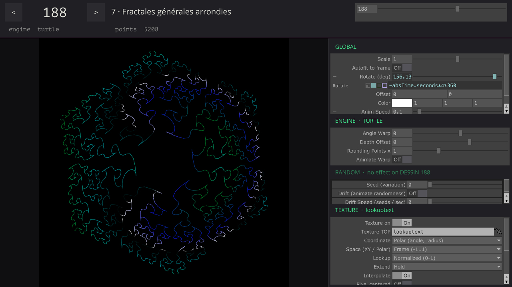

[English](README.md) · **Русский**

# Nouveaux dessins géométriques et artistiques — порт на TouchDesigner POPs

**Генератор векторной графики для TouchDesigner.** Этот форк перерисовывает все **300 рисунков** из книги Жан-Поля Делаэ 1985 года как живые **векторы**: полилинии, которые считаются на видеокарте в POPs. Что с ними делать — решаете вы:
- отрендерить в своей сцене;
- превратить в SOP или CHOP;
- отправить на лазер или плоттер;
- инстансить на них объекты или дальше обрабатывать в POPs.

В основе — [перекодировка на p5.js от v3ga](https://github.com/v3ga/nouveaux_dessins_geometriques_et_artistiques).



*Perform mode (F1): DESSIN 188, раскрашен круговой ramp-текстурой на странице Texture (координата Polar).*

- **Векторы, а не пиксели.** На выходе POP из отдельных line strips:
  - `P` в пределах ±1;
  - int-атрибут `LineBreak` в начале каждой линии;
  - float4 `Color` на каждой точке.

  Графика не зависит от разрешения, и каждая линия остаётся линией.
- **Только GPU.** Каждая точка каждого рисунка считается в compute-шейдерах (POPs — семейство операторов TD 2024+). JavaScript нет, Python геометрию не трогает.
- **Раскраска текстурой.** Линии можно покрасить любым TOP. Координата выборки — позиция, угол, длина вдоль линии, номер линии или номер точки.
- **Вживую.** Рисунки и их параметры меняются в реальном времени; любой параметр можно вести от звука.

Оригинальный README проекта v3ga (на английском и французском) — в конце [README.md](README.md#original-project-v3ga).

<p>
   
   
</p>

*DESSIN 42, 60, 92, 146 / 188, 222, 283, 29 — превью TouchDesigner. Для сравнения — плоттерные рисунки из книги: [146](img/NOUVEAU_DESSIN_GEOMETRIQUE_146.png) и [188](img/NOUVEAU_DESSIN_GEOMETRIQUE_188.png).*

## Содержание
- [Требования](#требования)
- [Быстрый старт](#быстрый-старт)
- [Как использовать выход](#как-использовать-выход)
- [Интерфейс](#интерфейс)
- [Параметры](#параметры)
- [Текстура](#текстура)
- [Как это устроено](#как-это-устроено)
- [Отличия от книги](#отличия-от-книги)
- [Файлы](#файлы)
- [Авторы и лицензия](#авторы-и-лицензия)

## Требования
- **TouchDesigner 2025.x** с POPs. Проект собран и проверен на **2025.33230**.
- **Видеокарта.** Любая, на которой работают POPs. На macOS (Metal) все префиксные суммы считаются во `float`, потому что `double`-атрибуты там не поддерживаются.

## Быстрый старт
1. Откройте `nouveaux_dessins_geometriques_et_artistiques.toe`.
2. Нажмите **F1** — Perform mode. Откроется панель управления `ndga/UI`.
3. Выберите рисунок параметром **Dessin** (1–300). Номера те же, что в книге и в скетчах p5.js, нужный движок выбирается автоматически.
4. Заберите векторы из `ndga/out1` в свою сеть (см. ниже).

Всё находится в `/project1/ndga`. Ramp рядом (`ramp1` → `lookuptext`) — демо-текстура.

## Как использовать выход
У `ndga` два выхода:
- **`out1`** (POP) — векторы;
- **`out2`** (TOP) — готовый рендер-превью.

Внутри `out1` берёт данные из `ndga/out_vector`. Что на выходе:
- **Геометрия.** Line strips в квадрате `x, y ∈ [-1, 1]` (y вверх, z = 0). Одна линия — один непрерывный штрих плоттера из книги (перо опущено).
- **Атрибуты.** `LineBreak` (int, 1 на первой точке каждой линии) и `Color` (float4).

Что можно сделать:
- **Рендер.** *Geometry COMP* с *Line MAT* (он читает `Color`) — так устроен `ndga/preview`.
- **Работа с POPs.** Трансформации, шум, шлейфы, ресемплинг, копирование на точки, инстансинг.
- **Экспорт.** Выгрузка точек (например, через *POP to DAT*) для плоттера, SVG или любого другого векторного формата.

Число линий и точек зависит от рисунка: текущее общее число показывает `Points` на странице Global.

## Интерфейс
`ndga/UI` — панель управления поверх custom-параметров `ndga` (скриншот выше). Своего состояния у неё нет, единственный источник правды — сам `ndga`.

- **Шапка.**
  - `<` / `>` листают рисунки; колесо мыши над большим номером делает то же самое.
  - Рядом: глава и название программы из книги, слайдер / поле Dessin, активный движок и число точек.
- **Превью.** Живой рисунок.
- **Боковая панель.** Родные Parameter COMP, четыре секции:
  - **Global**;
  - страница **активного движка** (меняется вместе с рисунком);
  - **Random** — показывает, использует ли текущий рисунок случайность вообще, и становится серой, если нет (см. ниже);
  - **Texture**.

### Random
На страницу **Random** реагируют только рисунки, в которых есть случайные числа. По коду книги это:
- 77–102 — иголки и нити из случайных стартовых точек;
- 247–250 — случайные блуждания;
- 287, 288, 290, 291 и 297–300 — «толпы» со случайной расстановкой или дрожанием.

Параметры:
- **Seed** выбирает вариант: один и тот же seed всегда даёт один и тот же рисунок.
- **Drift** плавно перетекает от одного seed к следующему, так что случайность анимируется, а не прыгает. **Drift Speed** — в seed'ах в секунду.

Для всех остальных рисунков эти параметры ничего не делают. Какой случай сейчас, показывают `Randomused` на `ndga` и заголовок секции Random в UI.

### Аудиореактив и внешнее управление
Любой custom-параметр `ndga` можно вести обычными средствами TouchDesigner:
- выражением, например `op('audio')['low']`;
- CHOP export;
- bind.

UI показывает параметр в его режиме (видно выражение, значение двигается) и **никогда его не перезаписывает**: перед каждой записью проверяется режим параметра. Вести можно и `Dessin`, например счётчиком для автопроигрывания. Тогда `<` / `>` ничего не делают, а значок в шапке объясняет почему.

Read-only параметры: Engine, `*dessin`, Points и Randomused.

## Параметры
Всё — на custom-страницах `/project1/ndga`:

| Страница | Что |
|---|---|
| **Global** | **Dessin** (1–300), Engine (только чтение), Scale, Autofit (вписывание в кадр на GPU), Rotate, Offset, базовый Color, скорость анимации Speed, Points (показ) |
| **Random** | **Seed**, *Drift* и Drift Speed (см. [Random](#random)); показ *Randomused* |
| **Texture** | раскраска линий из TOP (см. [Текстура](#текстура)) |
| Polar, Morph, Circles, Koch, Motif, Lines, Field, Implicit, IFS, Glyph, Turtle | живые параметры каждого движка: разрешение / плотность, сдвиг глубины, фаза / искажение / закрутка, переключатели анимации |

**Autofit.** Некоторые рисунки выходят за кадр — так и в книге (см. ниже). *Autofit* вписывает любой рисунок в ±0.95 на видеокарте.

## Текстура
Страница **Texture** красит рисунок из любого TOP на видеокарте (`ndga/texture`):

```
color → seglen → cum (префиксная сумма: длина, номер линии) → coord (Tuv) → lookupTexture POP → blend → out
```

| Параметр | Что |
|---|---|
| **Texture on**, **Texture TOP** | включение и TOP, из которого берём цвет (любое разрешение; в демо — `lookuptext`) |
| **Coordinate** | откуда берётся координата выборки: **Position XY** (u, v = x, y) · **Polar** (u = угол, v = радиус от центра) · **Along strip** (длина вдоль каждой линии: 0 в начале, 1 в конце) · **Strip number** (номер линии) · **Point number** (номер точки) |
| **Space** | для XY / Polar: **Frame** (квадрат ±1 → 0..1) или **Bounds** (габариты рисунка → 0..1) |
| **Lookup** | **Normalized** (0..1 — вся текстура) или **Sample index** (только Along / Strip / Point: целый индекс — это номер пикселя, т. е. линия N берёт пиксель N из ramp размером N×1) |
| **Extend** | Hold / Zero / Repeat / Mirror за пределами текстуры |
| **Interpolate**, **Pixel centered** | как на lookupTexture POP |
| **Scale UV**, **Offset UV**, **Scroll UV / sec** | `uv · scale + offset + scroll · time`; scroll анимирует текстуру вдоль выбранной координаты |
| **Blend**, **Mix** | Replace / Multiply / Add поверх базового Color, степень — Mix; альфа сохраняется |

Одномерные координаты (Along, Strip, Point) берут цвет из средней строки текстуры (`v = 0.5`), а в режиме Sample index — из строки 0. Если текстура выключена или TOP не задан, блок пропускается, и линии остаются базового цвета.

## Как это устроено

### Один контракт для всех движков
Программы из книги управляют перьевым плоттером:
- `M x,y` поднимает перо и переносит его;
- `D x,y` рисует линию до точки.

Значит, рисунок — это последовательность полилиний. Каждый движок устроен одинаково:

```
meta (константы DESSIN из книги)
  → pts          gridPOP, N точек (N — верхняя граница)
  → gen          glsladvancedPOP: пишет P, LineBreak (= "M" плоттера), [Alive]
  → [cull]       deletePOP Alive == 0     (пути переменной длины, отсечённые деревья, лишние строки глифов)
  → strips       linebreakPOP             (одна line strip на каждый штрих с опущенным пером)
  → out
```

Выходы движков собираются так:

```
switch_engine → autofit → fit (scale / rotate / offset) → color → texture → out_vector
```

Пространство выхода — `x, y ∈ [-1, 1]`, y вверх, на каждой точке int `LineBreak` и float4 `Color`. Плоттерное пространство книги (480 пикселей) нормализовано к нему. Всё считается во `float`, без `int()`-округления плоттерных строк, поэтому нет дублирующихся точек и отрезков нулевой длины.

### Движки

| Движок | DESSIN | Как разложено на GPU |
|---|---|---|
| `engine_motif` | 1–20 | поток = (копия, вершина). Индекс копии раскладывается в смешанной системе счисления на K преобразований (отражения, повороты, решётка). |
| `engine_glyph` | 21–29, 287–300 | Лица и глифы «толпы» берутся из таблицы, которую в шейдер подаёт `dattoPOP`. Поток = (экземпляр, строка таблицы); строки чужих глифов отсекаются. |
| `engine_polar` | 30–59 | поток = точка. Формулы — `switch` по DESSIN. |
| `engine_koch` | 60–69 | Каждая вершина считается **прямо из цифр её индекса в четверичной системе** (сумма хорд подгенераторов × Gᵈ). Префиксная сумма не нужна, угол генератора — живой параметр. |
| `engine_lines` | 70–73, 213–246 | Независимые отрезки: хорды Кантора, муары, проекции K-мерных гиперкубов (с живым вращением базиса проекции). |
| `engine_turtle` | 74–76, 143–212 | См. ниже. |
| `engine_field` | 77–122 | Иголки и линии тока. Поток = (стартовая точка, шаг j) интегрирует j шагов Эйлера; выход из единичного квадрата отсекает остаток. |
| `engine_morph` | 123–142 | поток = (слой, точка). Промежуточные кривые между двумя фигурами Лиссажу или между фигурой Лиссажу и квадратом. |
| `engine_implicit` | 247–250 | Случайные блуждания внутри F(x,y) < 0. Блуждание последовательно, поэтому **один поток ведёт одну стартовую точку** и пишет все её слоты. |
| `engine_circles` | 251–266 | поток = (ячейка, сегмент). Радиус пропорционален полю F(x,y). |
| `engine_ifs` | 267–286 | поток = (уровень, копия, вершина). Цифры индекса копии в K-ичной системе выбирают цепочку отображений; рисуются все уровни, как в книге. |

### Черепаха (обобщённый Кох)
Самое большое семейство — 73 рисунка: 143–182 (общие фракталы), 183–212 (их скруглённые варианты) и 74–76. В книге черепаха идёт шаг за шагом, но направление и длина каждого шага зависят **только от цифр номера шага**. Флаги B, E, C и D отражают, разворачивают, останавливают и поднимают перо. Поэтому обход можно распараллелить:

- **Шаги.** `gen` считает вектор каждого шага независимо.
- **Позиции.** `scan` (`accumulatePOP`) превращает шаги в позиции префиксной суммой.
- **Размещение.** `place` обнуляет сумму для каждой кривой и применяет поправки кадрирования из p5-порта.
- **Скругление.** `round` (183–212) заменяет каждый угол четвертью эллипса, как в книге: S+1 точек на шаг.
- **Отсечённые деревья.** Флаг **C** отсекает целые поддеревья: например, 177 перебирает 5¹⁰ ≈ 9,7 млн индексов ради примерно 4 тыс. шагов. Поэтому потоки нумеруются по **живым листьям**. Каждый поток превращает номер листа в путь по цифрам через число листьев поддерева `leaves(d) = n_terminal + n_recursive · leaves(d−1)`, и ни один поток не тратится впустую.
- **74–76.** Направление равно `AA · Σ(min(v(j), K−1) + 1)`, где v — (N−1)-адическое нормирование. Оно считается в замкнутом виде по формуле Лежандра `Σ floor(i / bᵗ)`.

### Исходники шейдеров
Compute-шейдеры живут внутри `.toe`, в DAT `shader` каждого движка. Текстовая копия выгружена в [`touchdesigner/shaders/`](touchdesigner/shaders), чтобы их было удобно читать и сравнивать на GitHub; источник правды — `.toe`. Каждый шейдер начинается с комментария, объясняющего разложение на потоки. `ndga/agents_md` внутри проекта описывает сеть, ловушки и отступления от книги.

## Отличия от книги
Намеренные изменения:
- **Случайность.** Случайные рисунки (77–102, 247–250, 287, 288, 290, 291, 297–300) используют хэш **с seed** вместо `random()` без seed: один Seed — один рисунок. *Drift* его анимирует.
- **153–161.** Глубина ограничена так, чтобы в кривой было не больше 300 тыс. шагов: 158–161 рисуются при K = 6, хотя книга просит 7⁷ … 7¹⁰ шагов.
- **247–250.** Случайные блуждания ограничены *Max Steps*; в книге они не ограничены. По умолчанию — 20 % стартовых точек книги.
- **Одиночные точки.** Потоки и блуждания, которые дали бы одну точку (вышли на первом же шаге), отбрасываются: одиночная точка — вырожденный штрих.
- **74–76.** Замыкающий отрезок `TRACE` (конец → начало) опущен.
- **Сетки окружностей.** Каждая окружность рисуется фиксированным числом сегментов. В книге число сегментов равно радиусу в пикселях, поэтому маленькие окружности превращаются в треугольники и ромбы.
- **Кох.** Слои меньшей глубины пересэмплированы к общему числу точек. Если угол генератора не 60°, кривая перенормируется, чтобы многоугольники оставались замкнутыми.

Оставлено как в p5-порте (так же и на картинках из книги):
- 300 вылезает за нижний край;
- 130, 135, 137, 142 и мотивы 12 и 18 выходят за кадр (используйте Autofit);
- 67, 91 и 126 сам p5-порт помечает *«output not correct»*.

## Файлы
```
nouveaux_dessins_geometriques_et_artistiques.toe   проект TouchDesigner (всё находится в /project1/ndga)
touchdesigner/shaders/*.glsl                       выгруженные compute-шейдеры (по одному на движок; turtle: + _place, _round;
                                                   texture_*: блок Texture)
touchdesigner/img/                                 превью и скриншот Perform mode для README
sketches/, img/                                    оригинальные скетчи p5.js и картинки из книги от v3ga
```

## Авторы и лицензия
- **Программы и книга:** [Жан-Поль Делаэ](https://fr.wikipedia.org/wiki/Jean-Paul_Delahaye), *Nouveaux dessins géométriques et artistiques avec votre micro-ordinateur*, Eyrolles, 1985.
- **Перекодировка на p5.js, библиотека-парсер и галерея:** [v3ga](https://github.com/v3ga/nouveaux_dessins_geometriques_et_artistiques). Благодарности Жан-Ноэлю Лафаргу и Эрику Шрафштеттеру — см. оригинальный README.
- **Порт на TouchDesigner POPs:** этот форк.

Форк распространяется под той же лицензией, что и оригинальный репозиторий, — **GNU General Public License v2.0**; см. [LICENSE](LICENSE).
